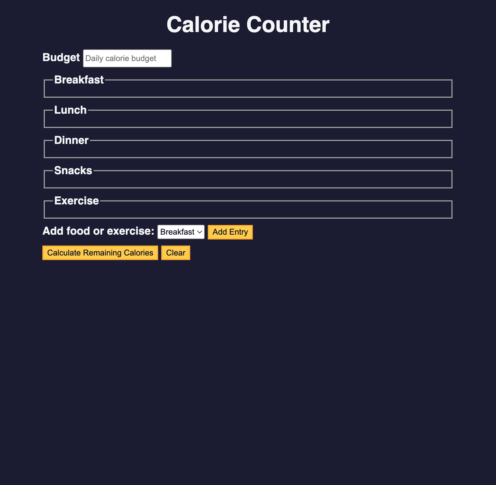

# Calorie counter

This is a task from Free Code Camp, where I learned JS basics.

### Link

- Live Site URL: (https://olenahelena.github.io/calorie_counter/)

### Built with

- Semantic HTML5 markup
- CSS
- JS

### Screenshot

